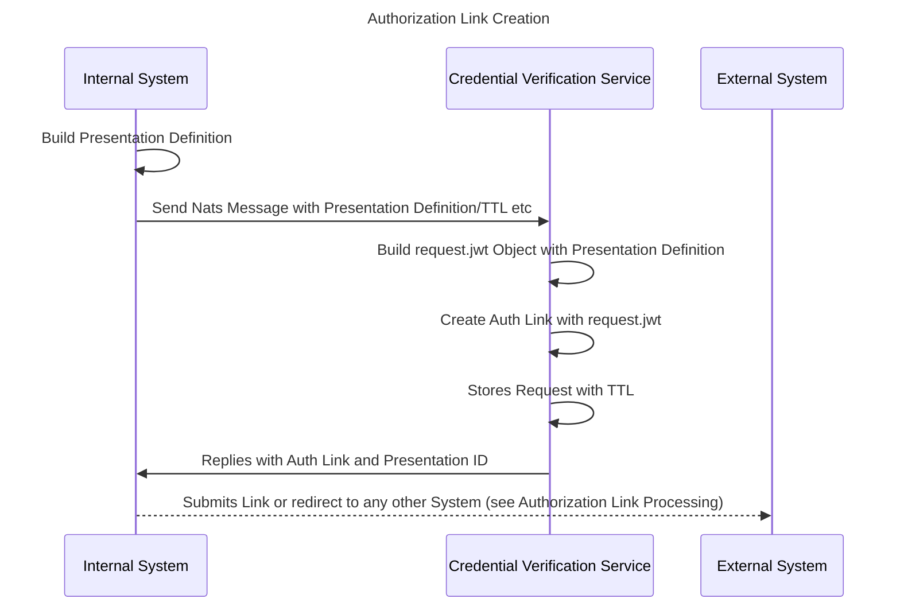
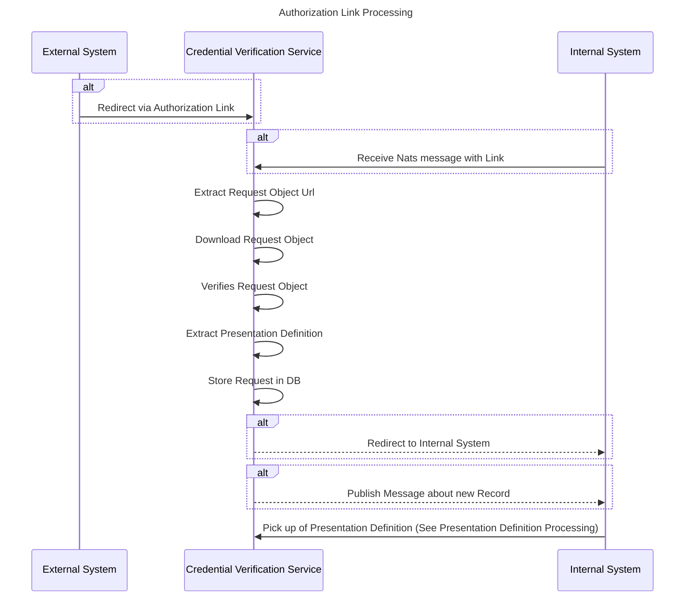
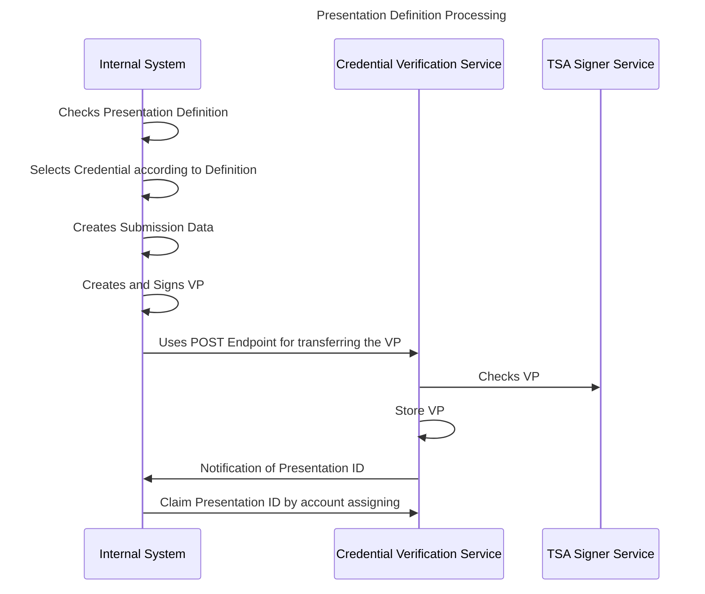

# Introduction

The credential verfication service fullfills two task: 

1. Receiveing Presentations and verifying it's credential content (credential verification execution)
2. Preparing Presentation Requests for fullfillment (credential verification preperation)

This processes are based on the [OID4VP](https://openid.net/specs/openid-4-verifiable-presentations-1_0.html) especially the [Cross Device Flow](https://openid.net/specs/openid-4-verifiable-presentations-1_0.html#section-3.2) which allows an interaction between different devices (in this case cloud services)

For this purpose the service is able to generate/process dynamically and cryptographically protected request.jwt objects which are prepared for each client, when a link is requested.

The service it self can be triggered over different ways: 

1. VP Authorization Requests can be triggered via Redirect or Nats
2. VP Authorization Links can be generated over Nats

The service itself stores each Request in a Cassandra DB, either for fullment a request or delivering the data to a link which was generated. 


# Flows

## Authorization Link Creation and Usage

A [nats message](https://gitlab.eclipse.org/eclipse/xfsc/organisational-credential-manager-w-stack/credential-verification-service/-/blob/main/pkg/messaging/types.go?ref_type=heads#L14) is sent to the service together with a TTL and a presentation definition, which the service stores along with a request.jwt object. If the link is later on used, the request.jwt is delivered. When the TTL is exceeded, the record is deleted and the link then not more usable. 



Note: Building a Presentation Definition is custom business and needs to be done by business specific controllers. 
Note: The credential selection is currently an functionality of storage service, but it can be selected from any other system which understands the way of doing it. 


## Authorization Link Processing

The processing of a link can be either done by redirect (if enabled) or by internal nats message. Both have in the end the same effect. 



## Presentation Definition Processing

After picking up a presentation definition the definition must be fullfilled by selecting the right credentials. 



Note: The Credential Verification Service can be either in the role of a holder or of a verifier. 


# Bootstrap


# Developer Information

## Retrieve data from database

### Retrieve Presentation Definitions

```bash
cqlsh <cassandra host> <cassandra port> -u <cassandra user> -p <cassandra password> -e "SELECT * FROM tenant_space.presentations;"

```